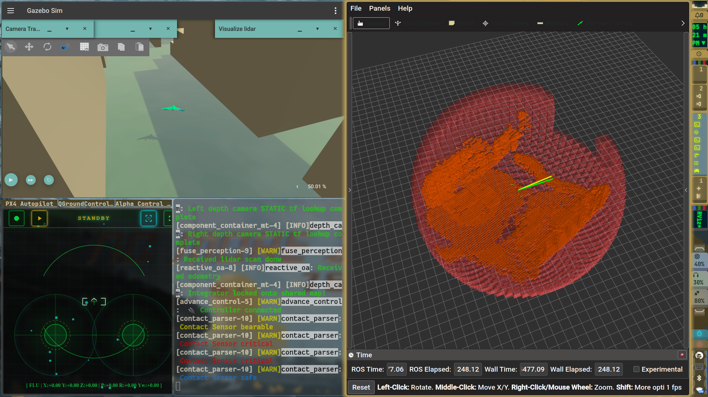
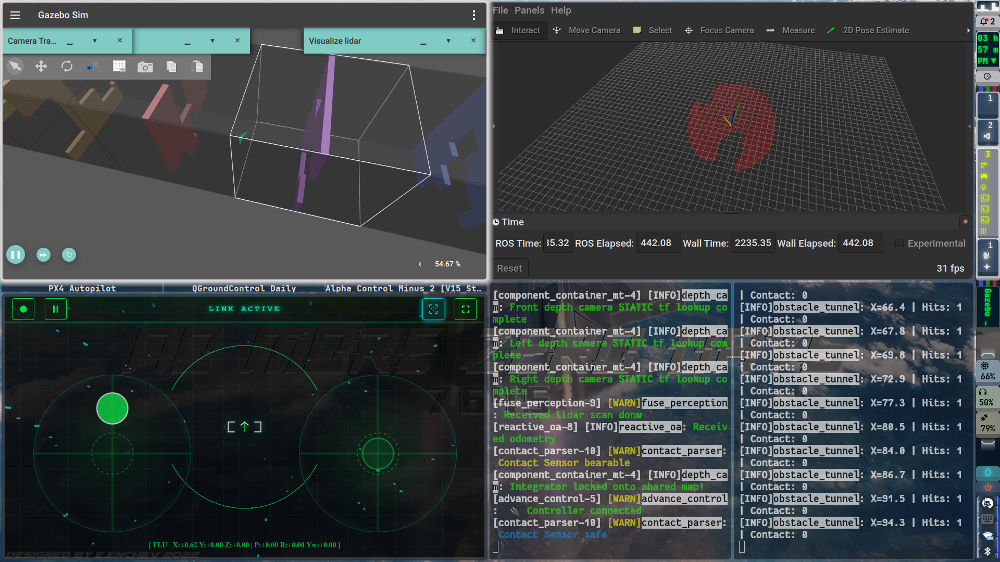

# Alpha Drone: Acrobatic Obstacle Avoidance & Flight Planning

Alpha Drone is an experimental drone flight control architecture focused on agile, sub-human level acrobatic flight and reactive obstacle avoidance. The system is designed to bridge the gap between high-level path planning and low-level instinctive flight maneuvers.

Currently, the project is deployed as a fully simulated proof-of-concept, serving as a foundation for future physical hardware integration.

## System Architecture

The control system is divided into a two-layer hierarchy to manage complex flight dynamics:

*   **The Brain (High-Level Planning):** Utilizes **Latent Diffusion Planning** to generate sophisticated, predictive flight paths through complex environments.
*   **The Spine (Low-Level Reflexes):** Acts as the reactive layer, handling immediate, short-latency obstacle avoidance and executing the "instinctive" acrobatic maneuvers required to stay airborne in tight spaces.

## Tech Stack & Environment

This project is built using modern robotics middleware and simulation tools. The current development environment runs locally and consists of:

*   **Middleware:** ROS 2 (Jazzy)
*   **Flight Controller:** PX4 Autopilot (SITL)
*   **Simulation:** Gazebo (Harmonic)

## Current Status

*   **Simulation Only:** The project is currently running entirely in simulation to safely train and validate the Latent Diffusion Planning models and the Spine reflex integration.
*   **Active Development:** Focus is currently on optimizing the latency and communication between the Brain and Spine layers to ensure seamless acrobatic responsiveness.
*   **Hardware:** No physical drone hardware is currently implemented. Hardware-in-the-loop (HITL) and real-world deployment are planned for future phases.

## Future Roadmap
*   [ ] Improve avoidance effectiveness and environment awareness for both Brain and Spine layers
*   [ ] Finalize integration structure and latency optimization between th two layers.
*   [ ] Expand simulated environments to include more complex, dynamic obstacles.
*   [ ] Deploy onto physical edge computing hardware onboard a real drone.
## Demo
Free environment fly:

Training loop environment:

